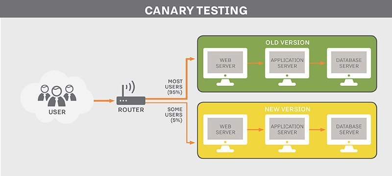

在煤矿中有毒或易燃气体的存在，常引起井下爆炸，或发生煤矿工人中毒的事故。人们发现，金丝雀对于这类气体很敏感，矿井中存在的微量有毒气体，在对矿工尚未造成威胁时，金丝雀就会出现窒息中毒的症状。所以，一些矿工在下井时带着金丝雀，将它们作为“生物报警器”。

## 1. 什么是 Canary Release？

Canary Release是一种最初将变更发布给一小部分用户的部署策略。随后使用业务 KPI 和运营指标仔细监控系统是否存在问题迹象。一旦您确信您的变更没有对功能、性能或安全性产生不利影响，就可以分批或一次性向其余用户推出这些变更。不过，最好是有一个或两个北极星指标，以在几个小时内确认更新没有问题。否则，将需要花几周或几个月监测，非常浪费时间。将接收更新的最初一部分用户比喻成煤矿中的金丝雀；如果在发布后检测到问题，那么损害仅限于他们。因此，大多数用户仍然不知情且不受影响。在部署无法在暂存环境中进行充分测试的高风险变更时，Canary 发布非常有用。

## 2. 为什么 Canary Release 是有效的？

Canary Release是对与添加新功能或创建新版本软件相关的代码进行增量更改的好方法。因为代码是在生产中发布给实际用户的，所以它使开发团队能够快速评估更改是否提供了期望或预期的结果。 Canary 部署还允许开发人员将一小部分用户迁移到新版本的新功能中。通过仅将整个用户群的一小部分暴露给新代码，使新功能相关的潜在问题的影响被最小化，同时使开发人员更容易回滚有缺陷的版本并防止它影响整个用户群。
通常，在金丝雀测试中，首先您需要两个相同的生产环境。这不一定是指两个独立的服务器。例如，您可以在同一台服务器上运行两个Web应用程序或者两个独立的镜像容器。当您准备好一个新版本时，您可以把它部署到一个环境中。然后，您将一小部分用户引导到这个 Canary版本。大约5%的用户是一个合适的测试量。这些用户将看到新的功能，而其他用户群则看不到任何变化。
现在，您可以监控这个Canary版本并修复任何出现的错误。目标不是要消除生产中的错误，而应该是尽量减少错误的影响。如果在新版本中有一个错误，只有5%的用户会受到影响。虽然这个错误仍然需要修复，但您所承受的压力会小于所有用户都遇到该错误时的压力。

## 3. Canary Release 是如何工作的？

#### 3.1 步骤一

  开发团队选择测试用户。该组是用户群的一小部分，但需要足够大以确保能产生有意义的统计分析结果。且用户不允许知道他们是测试组的一部分。大约5%的用户量是一个合适的测试量。

#### 3.2 步骤二

  开发团队设置一个与现有生产环境一样且并行运行的环境。配置系统负载平衡器以将用户请求从指定的路由切换至新环境。

#### 3.3 步骤三

  监测金丝雀容器中的用户的表现，如果新版本满足预定义的部署标准，则可以向所有用户发布新的软件功能或版本。但是，如果发现新版本包含很多错误，使应用程序性能不佳或给用户带来其他问题，您可以马上把它回滚，90%的用户甚至95%的用户都不会看到这个问题。

#### 3.4 步骤四

  当团队修复了发现的错误，您就可以把它逐步推向更多的用户，直到新版本被所有人使用。不过，您最好是有一个或两个北极星指标，以在几个小时内确认更新没有问题。否则，将需要花几周或几个月监测，非常浪费时间

  > 为5%或10%的用户推出金丝雀版本。
  >
  > 将Canary版本的规模扩大一倍或两倍。再次测试，从指标中收集反馈。
  >
  > 使用同样的程序更新70%的生产环境。
  >
  > 向100%的用户推出，并继续监测。

## 4. Canary Release 的优点

  * 降低风险：推出一个包含错误的新功能，往往会激怒用户。 如果这种情况经常发生，您的声誉就会受到影响。 如果一个严重的错误出现在产环境中，它将只影响少数用户。 这大大减少了对您组织的风险。
  
  * 减少对团队的压力：软件部署产生的焦虑会干扰您的工作职能、休假和睡眠。 通过一系列的金丝雀测试稳步建立信心，即由少数用户对功能进行预先测试，可以减少焦虑和压力，而提高工作质量。

  * 良好的商业策略：修复一个高度目标化的Canary测试问题，比修复已经推出到整个用户群的问题要容易得多，也省时得多。 如果该功能有问题，降低了应用程序的性能，或引起了用户的不良反馈，您也可以迅速删除它。

  * 生产测试：Canary方法允许测试人员在生产环境中测试，这意味着他们能在用户也会使用的环境中测试。 这在一定程度上解决会出现在生产环境中但未出现在暂存环境中的错误。

  * 测试版：可以与您的忠实客户或愿意试用您应用程序最新功能的用户建立一个测试程序。 用户可以被告知可能出现的问题，并向开发者提供反馈。

  * 更好的进度跟踪：您可以在增加负载时监测新代码的性能。

  * 多样化的测试：无论您是按地理位置、使用频率还是经验水平来分类，可为您的软件提供有价值信息的用户是没有限制的。

## 5. Canary Release 的缺点

  * 多重功能管理：如果要快速发布新功能，事情会变得很棘手。 假如您想测试两个新功能？ 那么您就需要三个环境：一个用于大多数用户，以及两个分别用于新功能的环境。 甚至可能需要第四个环境来一起测试这两个新功能？ 这会变得难以管理！ 使用功能发布标志（feature flags）将一个功能给一定比例的用户测试可以减轻这种痛苦。

  * 移动设备：移动应用通常是通过应用商店发布的，您无法选择哪个用户获得您应用的较新版本。 幸好，功能标志在这里又能帮上忙。 您可以在您应用程序的新版本中添加该功能，但只对一小部分用户启用。

  * 行业限制：为关键型或生命支持型系统的复杂软件的更新，比如控制能源网的应用程序、医院的生命支持系统、核反应堆 —— 所有这些都不能用Canary版本进行更新。

  * 技术限制：如果更新需要调整一些后台功能或数据存储，新版本与生产环境的其他部分会不兼容。 在这种情况下，Canary测试将很难实现。

## References

  [1] [https://www.techtarget.com/whatis/definition/canary-canary-testing](https://www.techtarget.com/whatis/definition/canary-canary-testing)
