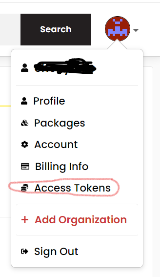
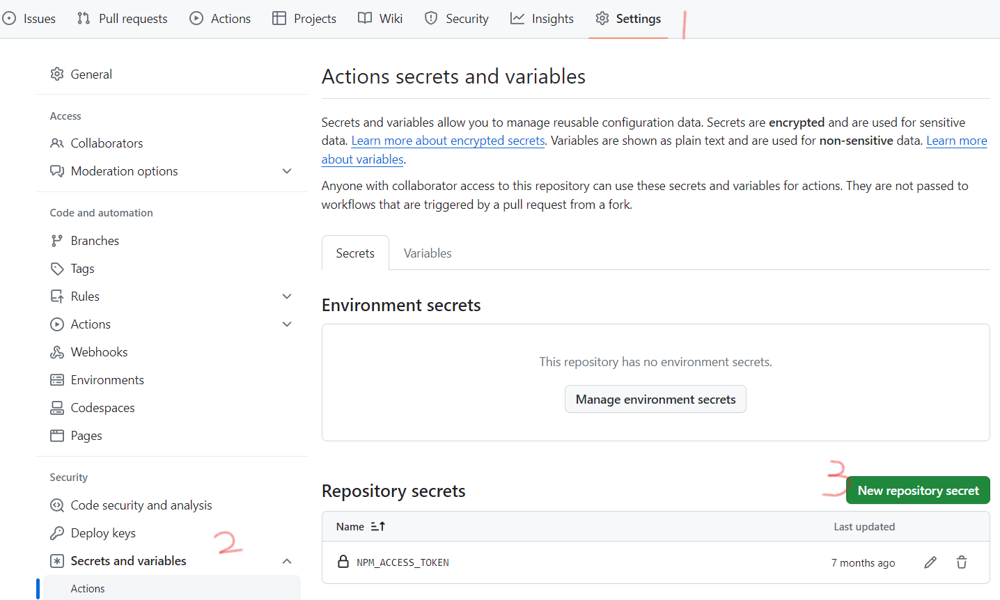

## 一、创建项目
- 1、在github上创建一个项目，然后拉取至本地，进入项目目录
- 2、执行 `npm init` 生成json文件
- 3、创建 `src/index.ts` 入口文件和 `src/isObject.ts` 工具方法

###### · src/index.ts
```javascript
export { default as isObject } from './isObject'
```

###### · src/isObject.ts
```javascript
/**
 * @description 判断是否为对象
 * @param {*} variable
 * @returns {Boolean}
 */
function isObject(variable: any): boolean {
    return Object.prototype.toString.call(variable) === '[object Object]'
}

export default isObject
```

## 二、配置Rollup打包
- 1、安装rollup和typescript `npm install rollup typescript -D`
- 2、创建 `tsconfig.json` 配置文件：
```json
{
    "compilerOptions": {
        "target": "es5" /* 编译目标 */,
        "module": "commonjs" /* 项目模块类型 */,
        "lib": ["ES2018", "DOM"],
        "allowJs": true /* 是否允许js代码 */,
        "checkJs": true /* 检查js代码错误 */,
        "declaration": true /* 自动创建声明文件(.d.ts) */,
        "declarationDir": "./lib/types" /* 声明文件目录 */,
        "sourceMap": true /* 自动生成sourcemap文件 */,
        "outDir": "lib" /* 编译输出目录 */,
        "rootDir": "./src" /* 项目源码根目录，用来控制编译输出的目录结构 */,
        "strict": true /* 启用严格模式 */
    },
    "include": ["src/*.ts"],
    "exclude": ["node_modules", "lib"],
}
```
- 3、安装rollup插件

 · 处理路径 `npm install @rollup/plugin-node-resolve -D`

 · 支持ts `npm install @rollup/plugin-typescript -D`

 · 处理commonjs `npm install @rollup/plugin-commonjs -D`

 · 压缩umd规范的输出文件 `npm install @rollup/plugin-terser -D`

 · 重新打包代码清理 `npm install rollup-plugin-delete -D`

- 4、创建 `rollup.config.js` 配置文件：

```javascript
const resolve = require('@rollup/plugin-node-resolve') // 处理npm包的相关引入依赖
const typescript = require('@rollup/plugin-typescript')
const commonjs = require('@rollup/plugin-commonjs') // 将commonJS的语法转化成ES2015 Module
const terser = require('@rollup/plugin-terser') // 代码压缩
const del = require('rollup-plugin-delete')

module.exports = [
    {
        input: './src/index.ts',
        output: [
            {
                dir: 'lib',
                format: 'cjs',
                entryFileNames: '[name].cjs.js',
                sourcemap: true, // 是否输出sourcemap
            },
            {
                dir: 'lib',
                format: 'esm',
                entryFileNames: '[name].esm.js',
                sourcemap: true, // 是否输出sourcemap
            },
            {
                dir: 'lib',
                format: 'umd',
                entryFileNames: '[name].umd.js',
                name: 'Umob', // umd模块名称，自动挂载至window
                sourcemap: true,
                plugins: [terser()],
            },
        ],
        plugins: [
            del({ targets: 'lib/*' }),
            resolve(),
            commonjs(),
            typescript({ module: 'ESNext' }),
        ],
    },
]
```
- 5、在package.json配置的scripts中增加构建脚本 `"build": "rollup -c"`
- 6、执行 `npm run build`

## 三、手动发布
- 1、完善配置文件
##### · .npmignore
```shell
src/
node_modules/
.babelrc
.gitignore
```
##### · package.json
```json
{
	"name": "your project name",
	"version": "0.0.1",
	"description": "your project description",
	"browser": "lib/index.esm.js", // umd规范
	"module": "lib/index.esm.js", // 使用esm时，会使用这个包
	"jsnext:main": "lib/index.esm.js",  // 社区规范
	"main": "lib/index.cjs.js", // 当使用commonjs规范时会使用这个包
	"types": "lib/types/index.d.ts", // ts类型文件
	"files": ["lib"], // 用于约定在发包的时候NPM 会发布包含的文件和文件夹。
	"scripts": {
		"build": "rollup -c",
	},
	"keywords": [
		"modules",
		"stdlib",
		"util"
	],
	"author": "Unknow",
	"license": "MIT",
	"devDependencies": {
		"@rollup/plugin-commonjs": "^25.0.0",
		"@rollup/plugin-node-resolve": "^15.1.0",
		"@rollup/plugin-terser": "^0.4.3",
		"@rollup/plugin-typescript": "^11.1.1",
		"rollup": "^3.23.0",
		"rollup-plugin-delete": "^2.0.0",
		"tslib": "^2.5.2",
		"typescript": "~5.0.4"
	},
	"repository": {
		"type": "git",
		"url": "https://github.com/xxx.git"
	}
}
```
- 2、登陆npm账号(没有去官网注册一个) `npm login`
- 3、查看是否登录成功 `npm who am i`
- 4、将包推送至服务器 `npm publish`
- 5、package中的name不可与他人重复，否则会提示权限问题。如果使用`@[scope]/package`的命名形式，[scope]需要填账户名称

## 四、安装jest单元测试
- 1、安装 `install jest ts-jest @types/jest jest-environment-jsdom -D`
- 2、根目录下新增配置文件:

##### · .jest.config.js
```javascript
/** @type {import('ts-jest').JestConfigWithTsJest} */

module.exports = {
	preset: 'ts-jest',
	testEnvironment: 'jsdom', 
    clearMocks: true,
    collectCoverage: true,
    coverageDirectory: 'coverage',
    coverageProvider: 'v8',
    moduleFileExtensions: ["ts", "js"],
    // 配置测试环境ua
    testEnvironmentOptions: {
        userAgent: 'Mozilla/5.0 (Macintosh; Intel Mac OS X 10_15_7) AppleWebKit/537.36 (KHTML, like Gecko) Chrome/108.0.0.0 Safari/537.36',
    },
}
```
- 3、在 `package.json` 配置的scripts中增加测试脚本 `"test": "jest"`
- 4、编写单元测试：
##### · src/__tests__/isObject.test.ts
```javascript
import { isObject } from '../index'

describe('isObject: ', () => {
    it('Determine the type of number', async () => {
        expect(isObject(1)).toEqual(false)
    })

    it('Determine the type of string', async () => {
        expect(isObject('1')).toEqual(false)
    })

    it('Determine the type of boolean', async () => {
        expect(isObject(false)).toEqual(false)
    })

    it('Determine the type of array', async () => {
        expect(isObject([])).toEqual(false)
    })

    it('Determine the type of undefined', async () => {
        expect(isObject(undefined)).toEqual(false)
    })

    it('Determine the type of null', async () => {
        expect(isObject(null)).toEqual(false)
    })

    it('Determine the type of symbol', async () => {
        const symbol2 = Symbol('this is symbol')
        expect(isObject(symbol2)).toEqual(false)
    })

    it('Determine the type of empty object', async () => {
        expect(isObject({})).toEqual(true)
    })
})
```
- 5、增加单文件单元测试命令，用于团队本地开发测试使用 `"test:single": "node env-dependencies.js"`
- 6、在根目录下创建 `env-dependencies.js` 和 `.env.json` 文件

##### · env-dependencies.js

```javascript
const execSync = require('child_process').execSync
const pkg = require('./package.json')
const fs = require('fs')
const path = require('path')
const JSON_FILE_NAME = '.env.json'
const DEFAULT_TEST_FILE_NAME = 'isObject'
const filePath = path.join(__dirname, JSON_FILE_NAME) // 文件路径

// 检查文件是否已存在
if (!fs.existsSync(filePath)) {
	const content = {
		TEST_FILE_NAME: DEFAULT_TEST_FILE_NAME,
	}

	const jsonContent = JSON.stringify(content, null, 4)

	try {
		fs.writeFileSync(filePath, jsonContent, 'utf8')
	} catch (err) {
		console.error('写入文件时发生错误：', err)
	}
}

if (!pkg.envDependencies) {
	process.exit(0)
}

let env = Object.assign({}, process.env)

try {
	Object.assign(env, require('./' + JSON_FILE_NAME))
} catch (err) {
	console.log('Could not read or parse JSON_FILE_NAME.')
}

if (typeof pkg.envDependencies.params === 'undefined') {
	console.log('pkg.envDependencies.params not found or empty. Passing.')
	process.exit(0)
}

if (
	!Array.isArray(pkg.envDependencies.params) ||
	!(pkg.envDependencies.params.every(item => typeof item === 'string'))
) {
	throw new Error('pkg.envDependencies.params should have a signature of String[]')
}

const parsed = pkg.envDependencies.params.map(item => item.replace(/${([0-9a-zA-Z_]*)}/g, (_, varName) => {
	if (typeof env[varName] === 'string') {
		return env[varName]
	} else {
		throw new Error('Could not read env variable ' + varName + ' in params ' + item)
	}
})).join(' ')

try {
	execSync(parsed, { stdio: [0, 1, 2] })
	process.exit(0)
} catch (err) {}
```

##### · .env.json
```json
{
    "TEST_FILE_NAME": "isObject"
}
```

##### · 在package.json中增加字段
```json
"envDependencies": {
    "params": ["jest ./src/__tests__/${TEST_FILE_NAME}.test.ts --coverage --collectCoverageFrom=./src/${TEST_FILE_NAME}.ts"]
}
```
- 5、配置 `.gitignore` 和 `.npmignore`，忽略 `.env.json` 的提交
- 6、运行 `npm run test:single`，可测试 `.env.json` 中 `TEST_FILE_NAME` 字段配置的文件名

## 五、安装eslint
- 1、安装 `install eslint eslint-config-airbnb @typescript-eslint/eslint-plugin @typescript-eslint/parser -D`
- 2、新增配置文件:
##### · .eslintrc.js
```javascript
module.exports = {
    root: true,
    env: {
        browser: true,
        node: true,
        },
    extends: [
        'airbnb',
        'plugin:@typescript-eslint/recommended',
    ],
    parser: '@typescript-eslint/parser',
    plugins: [
        '@typescript-eslint',
    ],
    globals: {
        NodeJS: 'readonly',
    },
    settings: {
        'import/resolver': {
            node: {
                extensions: ['.js', '.ts']
            },
        },
        react: {
            version: '0.0.0',
        },
    },
    rules: {
        // 添加自定义规则
        'no-console': 2,
        'no-debugger': 2,
    },
}
```
- 3、增加lint命令 `"lint": "eslint --ext .ts src/"`
- 4、运行 `npm run lint`
- 5、安装husky，在代码提交前自动执行eslint校验 `npm install husky --save-dev`
- 6、启用git钩子 `npx husky install`
- 7、向package.json文件设置prepare脚本 `npm pkg set scripts.prepare="husky install"`
- 8、新增一个pre-commit钩子 `npx husky add .husky/pre-commit "npm run lint" `

## 六、自动化发布
- 1、在npm中生成 Access Tokens



- 2、将token复制到github对应仓库的秘钥中



- 3、设置一个变量名 `NPM_ACCESS_TOKEN`，用于之后CI中通过 `secrets.NPM_ACCESS_TOKEN` 获取
- 4、在根目录下创建 `.github/workflows/node.js.yml` 配置文件

```
name: Build CI

on:
  push:
    branches: [ "main" ]

jobs:
  build:

    runs-on: ubuntu-latest
    
    permissions:
      contents: write

    strategy:
      matrix:
        node-version: [16.20.0]

    steps:
      - name: 检出分支
        uses: actions/checkout@v3

      - name: 初始化缓存
        uses: actions/cache@v3
        id: cache-dependencies
        with:
          path: node_modules
          key: ${{runner.OS}}-${{hashFiles(\'**/package-lock.json\')}}

      - name: Use Node.js ${{ matrix.node-version }}
        # 使用actions/setup-node插件
        uses: actions/setup-node@v3
        with:
          # node版本
          node-version: ${{ matrix.node-version }}
          cache: 'npm'
      - run: npm ci
      # 生成测试覆盖率
      - run: npm run test
      - run: npm run build
      
      - name: 上报测试覆盖率
        id: coverRate
        uses: coverallsapp/github-action@master
        with:
          github-token: ${{ secrets.GITHUB_TOKEN }}

      - name: 读取版本号
        id: version
        uses: notiz-dev/github-action-json-property@release
        with:
          # 读取版本号
          path: './package.json'
          prop_path: 'version'

      - name: 打印版本号
        run: echo ${{steps.version.outputs.prop}}

      - name: 创建Release
        uses: softprops/action-gh-release@v1
        with:
          files: |
            ./lib/index.umd.js
            ./lib/index.esm.js
            ./lib/index.cjs.js
          name: v${{steps.version.outputs.prop}}
          tag_name: v${{steps.version.outputs.prop}}
        env:
          GITHUB_TOKEN: ${{ secrets.GITHUB_TOKEN }}

      - name: 发布NPM包
        run: |
          npm config set //registry.npmjs.org/:_authToken=$NPM_TOKEN
          npm publish
        env:
          # 配置 npm access token 环境变量
          NPM_TOKEN: ${{secrets.NPM_ACCESS_TOKEN}}
```

## 七、为readme添加测试覆盖率badge
- 1、进入coveralls官网，授权 [github，https://coveralls.io/](github，https://coveralls.io/)
- 2、授权后点击左侧侧边栏的 `ADD REPOS`，将需要生成badge徽章的库设置为on
- 3、在readme中添加连接即可查看 ``

## 八、整体目录结构
```shell
- .github
    - workflows
        - xx.yml        # git Actions
- .husky
    _
    pre-commit          # git提交钩子
- src
    - __test__          # 单元测试
    - index.ts          # 入口文件
    - isObject.ts
- .env.json             # 环境变量配置
- .eslintignore
- .eslintrc.js
- .gitignore
- .npmignore
- env-dependencies.js   # 环境变量读取脚本
- jest.config.js
- package.json
- rollup.config.js
- tsconfig.json
```

## 九、完整package.json配置
```json
{
	"name": "your project name",
	"version": "0.0.1",
	"description": "your project description",
	"browser": "lib/index.esm.js",
	"module": "lib/index.esm.js",
	"jsnext:main": "lib/index.esm.js",
	"main": "lib/index.cjs.js",
	"types": "lib/types/index.d.ts",
	"files": ["lib"],
	"scripts": {
		"lint": "eslint --ext .ts src/",
		"build": "rollup -c",
		"test": "jest",
		"test:single": "node env-dependencies.js",
		"prepare": "husky install"
	},
	"envDependencies": {
		"params": ["jest ./src/__tests__/${TEST_FILE_NAME}.test.ts --coverage --collectCoverageFrom=./src/${TEST_FILE_NAME}.ts"]
	},
	"keywords": ["modules", "stdlib", "util"],
	"author": "Unknow",
	"license": "MIT",
	"devDependencies": {
		"@rollup/plugin-commonjs": "^25.0.0",
		"@rollup/plugin-node-resolve": "^15.1.0",
		"@rollup/plugin-terser": "^0.4.3",
		"@rollup/plugin-typescript": "^11.1.1",
		"@types/jest": "^29.5.2",
		"@typescript-eslint/eslint-plugin": "^5.59.9",
		"@typescript-eslint/parser": "^5.59.9",
		"babel-jest": "^29.5.0",
		"eslint": "^8.42.0",
		"eslint-config-airbnb": "^19.0.4",
		"husky": "^8.0.3",
		"jest": "^29.5.0",
		"jest-environment-jsdom": "^29.5.0",
		"rollup": "^3.23.0",
		"rollup-plugin-delete": "^2.0.0",
		"ts-jest": "^29.1.0",
		"tslib": "^2.5.2",
		"typescript": "~5.0.4"
	},
	"repository": {
		"type": "git",
		"url": "https://github.com/xxx.git"
	}
}
```

## References

[1] [使用Typescript和Rollup从零开发一个工具库](https://segmentfault.com/a/1190000043133254)

[2] [一篇文章教会你如何在npm上传自己的包](https://blog.csdn.net/weixin_51499232/article/details/124940480)

[3] [husky工具介绍](https://zhuanlan.zhihu.com/p/638039824)